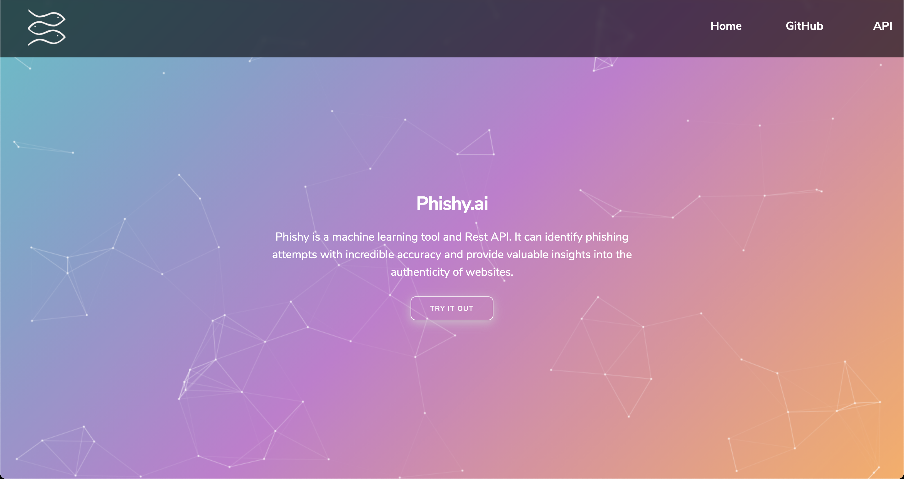
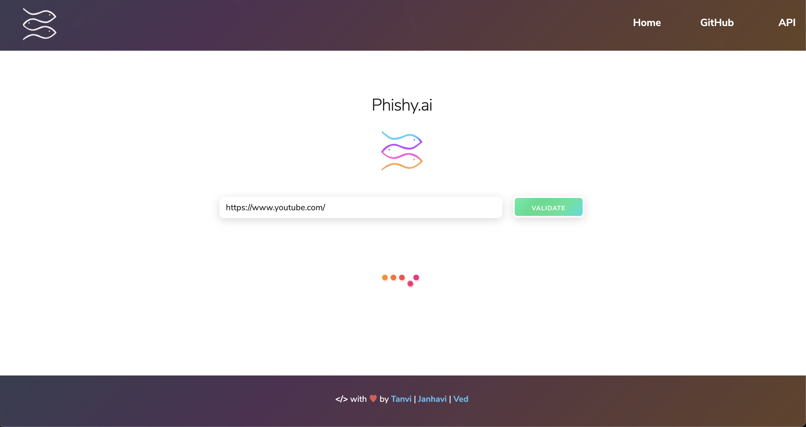
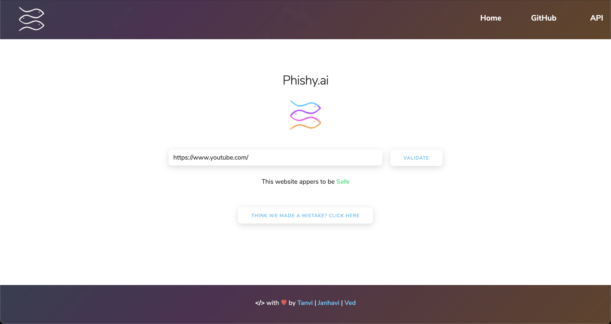

# Phishy API

**Note:** The is a fork of Phishy for deployment to Heroku. The full project with the ML models, datasets and installation instructions can be found [here](https://github.com/tanvig14/Phishy/). This repo is meant for contributors or people who are looking to deploy their own forks of Phishy to Heroku. If you are confused about which project you need to fork, please feel free to reach out to us through the Issues tab [here](https://github.com/tanvig14/Phishy/issues).

Phishing scams have become a huge problem in today's online landscape. 1 in every 8 employees shares information to a phishing site,
more than 60,000 phishing websites were reported in March 2020 alone and 22% of all data breaches in 2020 involved phishing attacks. This makes dealing with Phishing sites extremely important and the development of robust anti-phishing tools is a great place to start. That's where `Phishy` comes in.

Phishy is a machine learning tool and Rest API. It can identify phishing attempts with incredible accuracy and provide valuable insights into the authenticity of websites.

## Background

While building Phishy, we used a diverse tech stack to develop a comprehensive feature extraction toolkit and implemented an SVM model to classify a given website as `Safe` or `Phishy`. The features we used for our model are based on [research](https://archive.ics.uci.edu/ml/datasets/phishing+websites#) which narrowed down the identifying characteristics of malicious website. You can find the documentation for the features we used [here](https://github.com/tanvig14/Phishy/blob/main/FEATURES.md). 

Our model was trained on data from `UC Irvine's Machine Learning Repository`. You can find more information [here](https://archive.ics.uci.edu/ml/datasets/phishing+websites#). This dataset has over eleven thousand entries, each one contaning thirty features and a final result that tells us whether the website is a Phish or not. 

For our purpose, we narrowed the data down to 14 relevant features before training and validating our model. As it naturally follows, our extraction tools enable the discovery of the same features to facilitate the binary classification.

This implementation gave us promising results. After splitting our data in a 80:20 ratio for training : testing, we were able to achieve the following statistics:
* `Accuracy: 0.9072817729534147`
* `F1 Score: 0.9186830622768742`
* `Precison: 0.9004665629860031`
* `Recall: 0.9376518218623482`

## API

We plan on making Phishy's technology as platform agnostic as possible. That's why we have deployed it as a `Rest API`. You can find more information about the API on our [Website](https://phishy-ai.herokuapp.com/) or by clicking [here](https://github.com/tanvig14/Phishy/blob/main/API.md). We plan on using the same API to develop our Chrome extension and possibly our mobile applications. 

This repo is the heroku deployment for Phishy. If you are interested in finding out more about Phishy, we recommend checking the our orignal project [here](https://github.com/tanvig14/Phishy/). 

## Privacy

We believe that your data is yours only. That is why we do not collect or store any personal data or telemetry. Our logs only store the URL's passed with the API calls. Moreover, all our source code is uploaded right here for you to comb through. Our website is not embeded with any trackers or ad's and we intend on keeping it that way.

If you like this approach to software development, please consider supporting us through our orignal repository which you can find [here](https://github.com/tanvig14/Phishy/).

## Found Bugs?
Please refer to the orignal repository for bug reporting. You can find it [here](https://github.com/tanvig14/Phishy/).

## Contributing
This repo is intended for heroku deployment. If you're interested in contributing to Phishy, please check our orignal repository [here](https://github.com/tanvig14/Phishy/).

## Team
This Project was created by:

* [Ved Shah](https://www.linkedin.com/in/ved-shah-852a52181/) [Backend & Machine Learning]
* [Janhavi Shah](https://www.linkedin.com/in/janhavi-shah-615396193/) [UX, Frontend & Graphics]
* [Tanvi Gandhi](https://www.linkedin.com/in/tanvi-gandhi14/) [Backend & Machine Learning]

Please feel free to reach out to any of us if you have any questions about Phishy or if you want to nerd out in general. 
